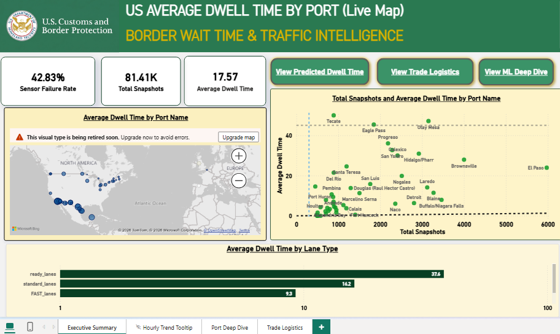


# Border Wait Time Analytics: A Real-Time Automated Data Platform for U.S. Land Ports

**U.S. Customs and Border Protection (CBP)  | Microsoft Fabric | Power BI | Machine Learning**

---

## 📺 Video Walkthrough
 
Want to see the platform and dashboard in action? Check out walkthrough videos of the architecture, pipeline, and Power BI reports:
 
[](https://www.youtube.com/watch?v=42VM7YPUdqY)
 
Extended walkthrough video:
<br>
[](https://www.youtube.com/watch?v=WxNj1XoCjYY)
 
*Click the thumbnails above to watch the walkthrough on YouTube.*

---

---

# Project Overview

This project is an end-to-end data pipeline built entirely within Microsoft Fabric. It ingests live traffic telemetry from U.S. Customs and Border Protection (CBP), processes it through a Medallion architecture using PySpark, forecasts future delays using Machine Learning, and serves the insights via a Direct Lake Power BI model. It helps answer practical operational questions:

- Where are border delays increasing?
- Which ports and lanes experience the highest congestion?
- How does commercial traffic behave compared to passenger and pedestrian traffic?
- Can historical patterns help predict future wait times?
- How can decision-makers monitor border operations through an interactive BI solution?


The project covers the complete lifecycle:

> API → Data Pipeline → Lakehouse → Medallion Architecture → Star Schema → Machine Learning → Power BI Analytics

---

# The Business Problem
Border crossings are complex operational environments. Thousands of vehicles and pedestrians move through ports of entry every day, and delays can directly impact:

- International trade
- Supply chain efficiency
- Commercial transportation costs
- Passenger experience
- Border management decisions

The CBP Border Wait Times API provides live operational telemetry from U.S. land ports of entry along the Canadian and Mexican borders.

However, raw operational data is rarely analysis-ready.

**The API data contains challenges commonly found in real-world systems:**

- Nested JSON structures
- Multiple traffic categories
- Different lane eligibility rules
- Missing values
- "Update Pending" operational states
- Inconsistent operational conditions
- Time-based volatility

The challenge was to build a reliable analytical foundation that converts this raw telemetry into meaningful business insights.

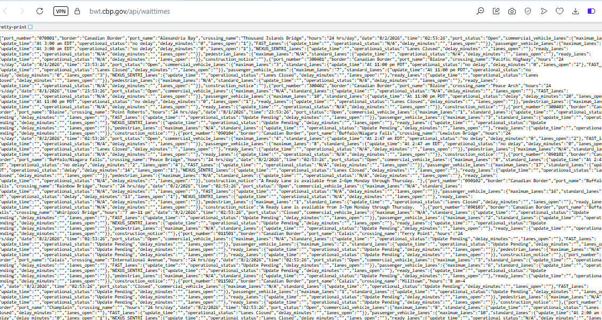

---

# Table of Contents

- [Project Overview](#project-overview)
- [The Business Problem](#the-business-problem)
- [Project Architecture](#project-architecture)
- [Objectives](#objectives)
- [Data Source](#data-source)
- [Understanding the Data](#understanding-the-data)
- [Technology Stack](#technology-stack)
- [Data Engineering Pipeline - Medallion Architecture](#data-engineering-pipeline---medallion-architecture)
- [Data Model](#data-model)
- [Machine Learning Forecasting](#machine-learning-forecasting)
- [Power BI Analytics Solution](#power-bi-analytics-solution)
- [Insights](#insights)
- [Challenges and Data Limitations](#challenges-and-data-limitations)
- [Future Enhancements](#future-enhancements)
- [How To Run](#how-to-run)

---

# Project Architecture

```
CBP API (hourly)
      │
      ▼
Data Pipeline (Web Activity → Copy Data Activity)
      │
      ▼
Lakehouse /Files/raw/bwt/YYYY/MM/DD/HH.json   ← Bronze
      │
      ▼
PySpark Notebook: parse, unpivot, clean       ← Silver (Fact_WaitTimes_Silver_New)
      │
      ▼
PySpark Notebook: star schema + surrogate keys ← Gold (Dim + Fact tables)
      │
      ▼
Random Forest Notebook: lag features, forecast ← Fact_WaitTime_Predictions
      │
      ▼
Direct Lake Semantic Model → Power BI Report
```

---

# Objectives

## 1. Build a Data Pipeline

Create an automated ingestion process that captures CBP border wait time data every hour.

## 2. Design a Scalable Analytics Architecture

Implement a Bronze-Silver-Gold Medallion architecture using Microsoft Fabric Lakehouse.

## 3. Transform Complex JSON Data

Convert nested API responses into structured analytical tables.

## 4. Create a Business-Friendly Data Model

Develop a star schema optimized for Power BI reporting.

## 5. Predict Border Wait Times

Build a machine learning model capable of estimating future wait times using historical patterns.

## 6. Deliver Executive-Level Analytics

Create an interactive Power BI dashboard for operational monitoring.

---

# Data Source

The project uses the official:

**U.S. Customs and Border Protection (CBP) Border Wait Times API**

**Source:**  
https://bwt.cbp.gov/api/waittimes

The API provides hourly operational information for U.S. land border crossings.

Each JSON record represents a specific border entry point at a specific time.

---

# Understanding the Data

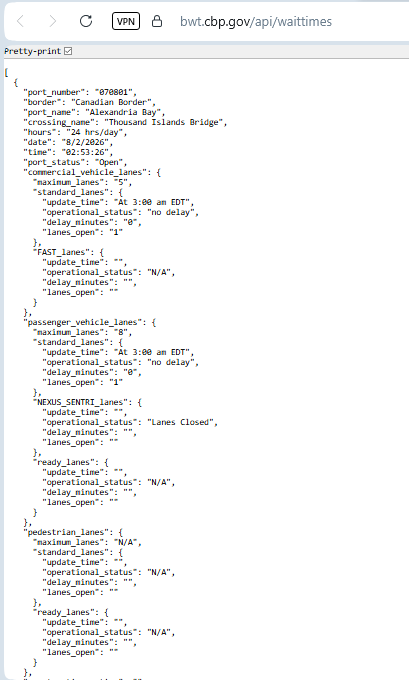

## Geography and Identity

| Field | Description |
|---------|-------------|
| border | Canadian Border or Mexican Border |
| port_name | Administrative border location |
| crossing_name | Physical crossing point |
| port_number | Unique CBP port identifier |
| hours | Port operating hours |

---

## Traffic Categories

CBP separates border movement into three operational streams:

### Commercial Vehicles

Includes:

- Freight trucks
- Supply chain shipments
- Trade-related traffic

### Passenger Vehicles

Includes:

- Personal vehicles
- Commuters
- Tourists

### Pedestrians

Includes:

- Individuals crossing by foot

---

## Lane Types

The API also tracks specialized lanes:

| Lane Type | Purpose |
|------------|----------|
| Standard Lanes | General travelers and vehicles |
| FAST Lanes | Pre-approved commercial truck program |
| NEXUS / SENTRI | Trusted traveler programs |
| Ready Lanes | RFID-enabled traveler lanes |

---

## Live Operational Metrics

Important telemetry fields include:

| Metric | Description |
|---------|-------------|
| operational_status | Current operating condition |
| delay_minutes | Estimated waiting time |
| lanes_open | Currently active lanes |
| maximum_lanes | Total available capacity |

---

# Technology Stack

## Data Engineering

- Microsoft Fabric
- Fabric Data Pipelines
- Fabric Lakehouse
- PySpark
- Delta Tables

## Analytics

- Power BI
- DAX
- Direct Lake Semantic Models

## Machine Learning

- Python
- Pandas
- Scikit-learn
- Random Forest Regression
- MLflow Tracking

## Data Storage

- Delta Lake
- Star Schema Modeling

---

# Data Engineering Pipeline - Medallion Architecture

Raw JSON files are processed through a structured transformation pipeline split into two orchestrated Spark notebooks (01_Silver_BWT_Processing and Gold layer transformation), chained together via a Fabric data orchestrator (bwt_transformation_orchestrator).

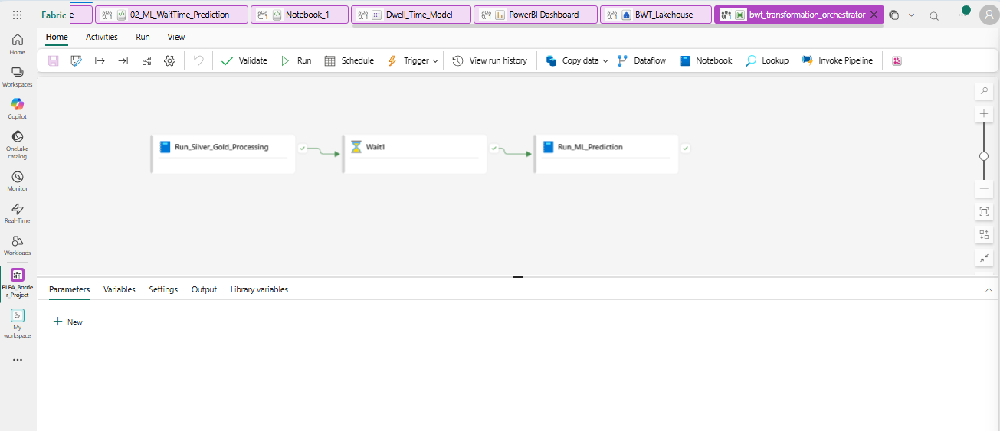
<br>

## Bronze Layer (Raw Zone)
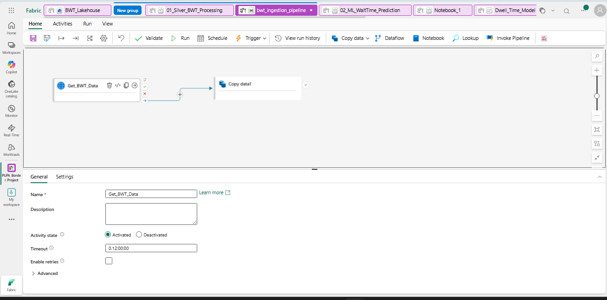
<br>

Stores raw, unedited hourly JSON snapshots (Files/raw/bwt/YYYY/MM/DD/HH.json).


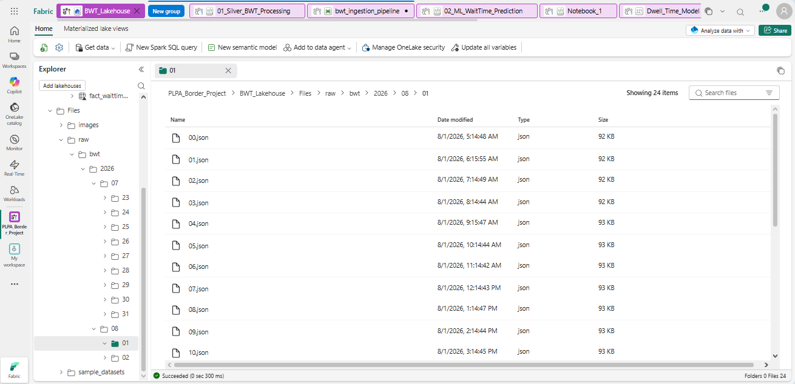

The ingestion pipeline is operational and continuously capturing live CBP API telemetry through scheduled Microsoft Fabric pipeline runs every hour.

---

## Silver Layer (Cleaned & Unpivoted)

The Silver layer cleans and normalizes the raw JSON.

### Major Transformations

- Flatten nested lane structures
- Extract timestamps from ingestion folders
- Standardize operational fields
- Converted operational statuses such as "Lanes Closed" or "Update Pending" into clean NULL values while casting delay minutes and active open lanes into proper integers.

The nested API structure was transformed into a delta table:

### `Fact_WaitTimes_Silver_New`

Example fields:

- port_number
- port_name
- border
- snapshot_utc
- traffic_pillar
- lane_type
- lanes_open
- operational_status
- wait_time_min

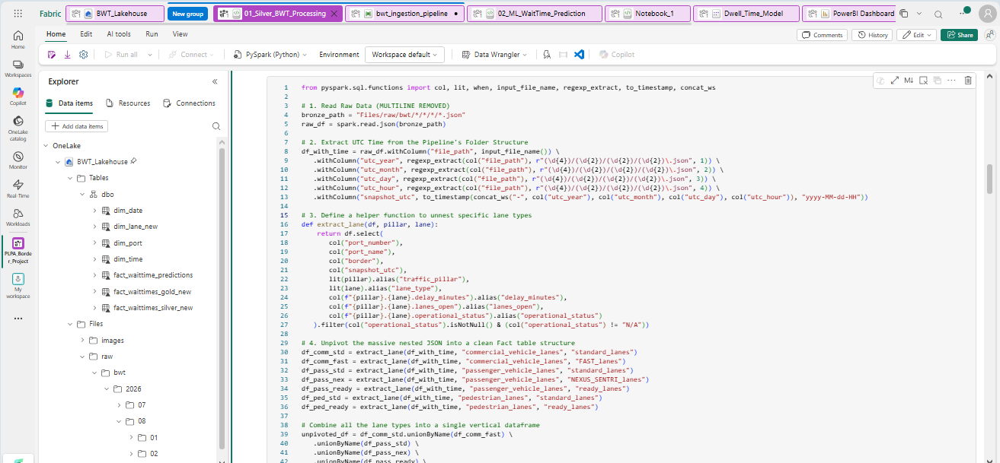

---

## Gold Layer (Star Schema)

Transformed the cleaned data into a high-performance star schema consisting of 4 Dimension tables and 3 Fact tables:

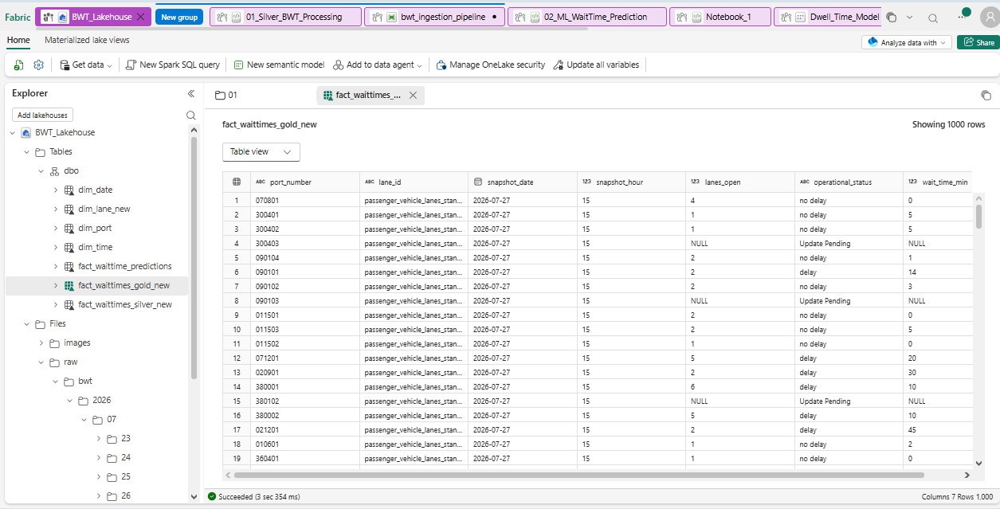

---

# Data Model

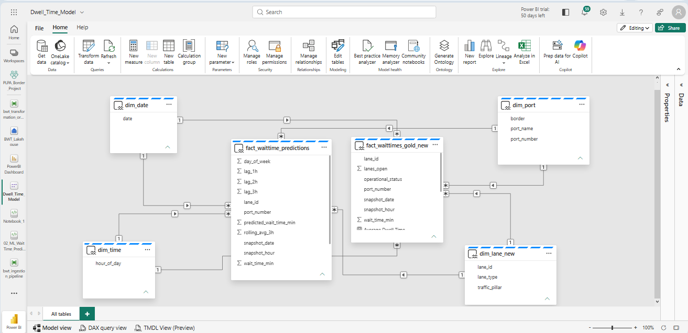

The final model contains:

## Dimension tables
- `Dim_Date` — one row per calendar date
- `Dim_Time` — hour of day, 0–23
- `Dim_Port` — port number, port name, border (Canadian/Mexican), ~87 ports
- `Dim_Lane_New` — the 7 valid lane_id / traffic_pillar / lane_type combinations

---

## Fact Tables

### Fact_WaitTimes_Gold_New

Primary operational analytics table.

Contains:

- port_number
- lane_id
- snapshot_date
- snapshot_hour
- lanes_open
- operational_status
- wait_time_min

---

### Fact_WaitTimes_Silver_New

Normalized operational staging table.

---

### Fact_WaitTime_Predictions

Machine learning prediction output.

Contains:

- historical wait time
- lag features
- rolling averages
- predicted wait time

---

# Machine Learning Forecasting

To explore predictive analytics, I developed a **Random Forest Regression** model.

## Goal

Predict future border wait times using historical operational patterns.

---

## Feature Engineering

### Historical Lag Features

- lag_1h
- lag_2h
- lag_3h

### Rolling Statistics

- rolling_avg_3h

### Time Features

- hour of day
- day of week

### Categorical Features

- port_number
- lane_id

---

## Model Evaluation

The model was evaluated using a 80/20 train-test split. As the pipeline ingests new hourly data, the cutoff shifts automatically without breaking the code.

### Dataset Size

| Metric | Value |
|----------|---------|
| Training Rows | 24,451 |
| Testing Rows | 6,264 |

### Performance Metrics

| Metric | Value |
|----------|---------|
| Test MAE | 5.32 minutes |
| Test RMSE | 12.24 minutes |
| R² Score | 0.795 |

### Baseline Comparison

| Metric | Value |
|----------|---------|
| Baseline MAE | 8.99 minutes |
| Random Forest MAE | 5.32 minutes |
| Improvement | 3.67 minutes |

The model demonstrates that historical traffic patterns contain useful predictive signals.

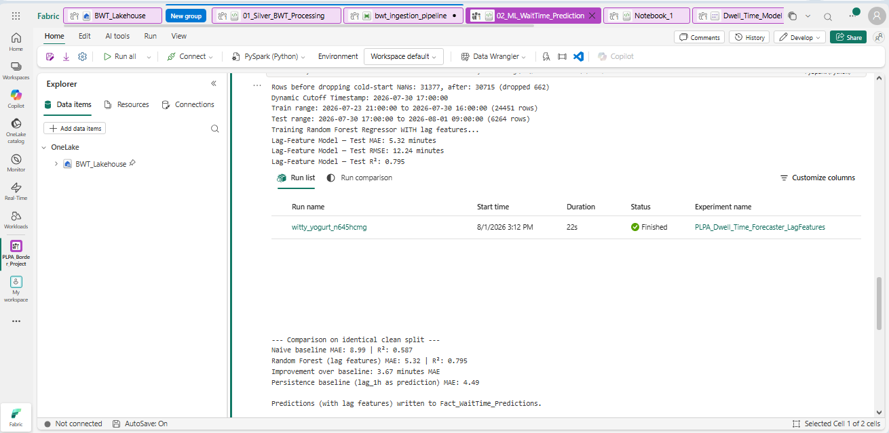

---

# Power BI Analytics Solution

The final reporting layer was built using a **Direct Lake Semantic Model**.

The dashboard includes:

---

## Executive Summary Page

### Features

- KPI cards
- Average dwell time
- Sensor failure rate
- Total snapshots
- Geographic bottleneck analysis
- Lane performance comparison
- Port outlier detection through scatter plot


---

## Port Deep Dive

Includes:

- Actual vs predicted wait times
- Operational matrix
- Hourly performance analysis

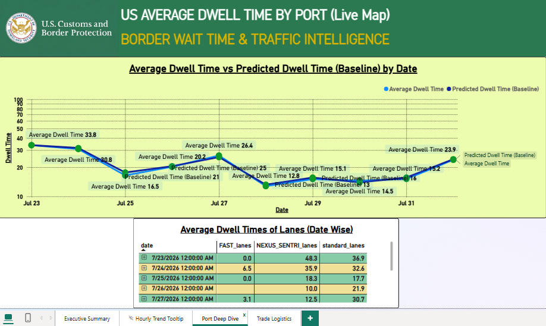

---

## DAX Measures

Organized into clean Display Folders for model hygiene.

### 1. Base Metrics

```dax
Total Snapshots = COUNTROWS('Fact_WaitTimes_Gold_New')

Sensor Failure Rate = 
DIVIDE(
    CALCULATE([Total Snapshots], 'Fact_WaitTimes_Gold_New'[operational_status] = "Update Pending"),
    [Total Snapshots]
)

Average Dwell Time = AVERAGE('Fact_WaitTimes_Gold_New'[wait_time_min])

Max Bottleneck = MAX('Fact_WaitTimes_Gold_New'[wait_time_min])
```

### 2. Intelligence & Filters

```dax
Commercial Dwell Time = 
CALCULATE([Average Dwell Time], 'Dim_Lane_New'[traffic_pillar] = "commercial_vehicle_lanes")

Critical Delay Count = 
CALCULATE(COUNTROWS('Fact_WaitTimes_Gold_New'), 'Fact_WaitTimes_Gold_New'[wait_time_min] > 60)

Previous Day Dwell Time = 
CALCULATE([Average Dwell Time], PREVIOUSDAY('Dim_Date'[date]))

DoD Dwell Time Growth % = 
DIVIDE([Average Dwell Time] - [Previous Day Dwell Time], [Previous Day Dwell Time])
```

### 3. ML Evaluation

```dax
Predicted Dwell Time (RF) = AVERAGE('Fact_WaitTime_Predictions'[predicted_wait_time_min])

Predicted Dwell Time (Baseline) = AVERAGE('Fact_WaitTime_Predictions'[lag_1h])

Model Variance = [Average Dwell Time] - [Predicted Dwell Time (RF)]
```


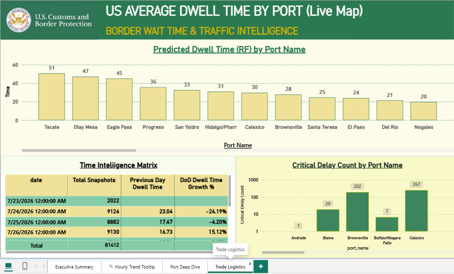

---

# Insights

- Wait times are highly autocorrelated hour-to-hour — the biggest predictive signal isn't fancy engineering, it's simply "what was it an hour ago," which matters for how much ML infrastructure is actually worth building here versus a simpler rule-based alert.

- A meaningful share of records report "Update Pending" rather than a real status, which is itself an operational signal — it usually means a sensor or officer hasn't reported recently, not that the lane is clear.
- Commercial lanes and passenger standard lanes behave very differently — trusted-traveler programs (NEXUS/SENTRI, FAST) consistently show shorter, more stable waits, which is the whole point of those programs, but it also means a single "average wait time" metric per port can hide which lane type is actually the bottleneck.

---


# Challenges and Data Limitations

Real-world data is imperfect.

## 1. Persistence baseline is nearly as strong as the Random Forest.
 I'm stating this plainly rather than hiding it, the model adds real value over a naive historical average, but the marginal gain over "just use the last hour's value" is modest. A more sophisticated time-series approach (e.g., gradient boosting with more contextual features, SARIMA) would likely be needed to meaningfully beat persistence.

## 2. Single data source. 
There's no cross-validation against a second, independent source of border conditions.

## 3. Missing Values

The API contains:

- N/A values
- Empty strings
- Update Pending records

Handling these required data-quality rules during transformation.

---

## 4. Time Zone Complexity

The API contains local port timestamps across different U.S. time zones.

A consistent UTC snapshot approach was used for analytics.

---

## 5. Traffic Volatility

Border wait times can change quickly because of:

- peak hours
- inspections
- staffing changes
- operational events

Predictions should be interpreted as decision-support signals rather than exact guarantees.

---

## 6. Lane Eligibility

A low wait time in FAST, NEXUS, or SENTRI lanes does not represent availability for general travelers.

Lane type context is essential.

---

# Future Enhancements

## 1. Real-Time Streaming

Move from hourly batch ingestion toward streaming architecture.


## 2. Advanced Forecasting

Experiment with:

- XGBoost
- LightGBM
- Time-series models


## 3. Data Quality Monitoring

Add automated checks for:

- missing ports
- delayed API updates
- abnormal values


## 4. Operational Alerts

Create notifications for:

- extreme delays
- unusual congestion patterns
- sudden capacity drops

## 5. Deployment

Add CI/CD practices for:

- Fabric pipelines
- notebooks
- Power BI deployment

---

# How To Run

## Steps

This project runs inside Microsoft Fabric and depends on a Fabric trial or licensed workspace.

1. Create a Fabric workspace and a Lakehouse (`BWT_Lakehouse`).
2. Build the ingestion pipeline: a Web Activity hitting https://bwt.cbp.gov/api/waittimes, feeding a Copy Data Activity that lands JSON into `Files/raw/bwt/YYYY/MM/DD/HH.json` using dynamic path expressions. Test manually before scheduling.
3. Attach a PySpark notebook to the Lakehouse and run the Bronze → Silver → Gold transformation logic (see `/notebooks` in this repo).
4. Run the ML notebook to train the Random Forest and write predictions back to Delta.
5. Chain both notebooks into a second orchestration pipeline with a dependency arrow and schedule it.
6. Build a Direct Lake semantic model over the six production tables, wire up the star-schema relationships, and add the DAX measures in `/dax`.
7. Build the Power BI report pages as described above, or open the `.pbix` in this repo


---

## Author

If you're hiring, or just want to talk data, I'd genuinely love to connect.

Email: [muhammadhannanbaig@gmail.com]

Linkedin: [https://www.linkedin.com/in/hannan-baig/]

Github [https://github.com/hannanbaig347]

---

**Built with curiosity, persistence, and a focus on solving real-world data problems.**
